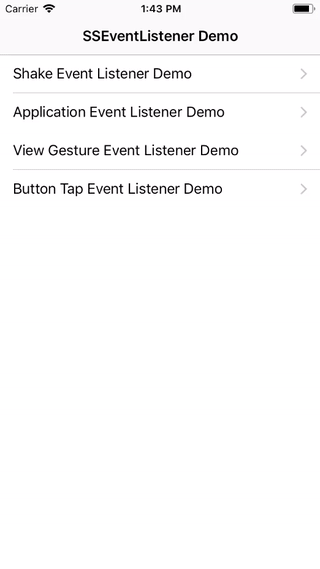
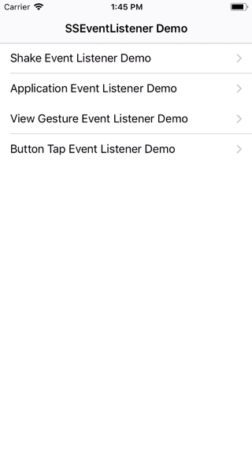
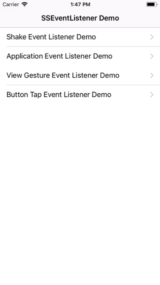
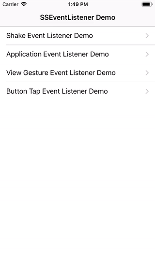

# SSEventListener

`SSEventListener`是一款iOS开源库，它提供了用**block**的方式来监听**手机摇动、UIApplication生命周期事件、view点击、长按手势以及button点击事件**。这款开源库做的事情其实是对iOS操作系统对于监听各种事件的封装，系统提供的方式需要做一些重写方法或者添加target之类的操作，但是用这个库你可以以block的形式来监听各种事件，你的代码将会变得优雅，具有更好的可读性，开发效率也能得到提高。

## 特性

* **手机摇动监听**: iOS SDK提供的监听手机摇动事件需要view controller覆盖`motionEnded:withEvent:`方法并且检测`event`参数，但是`SSEventListener`可以让你免去这些操作，直接调用`[viewController ss_setShakeEventListener:^{ ... }];`就可以设置摇动监听。
* **程序生命周期事件监听**: 使用这个库来监听程序生命周期事件比如`UIApplicationDidEnterBackgroundNotification`、 `UIApplicationWillEnterForegroundNotification`等，你也不需要使用`NSNotificationCenter`来添加observer，只需要对你想设置监听的object调用`[object ss_setApplicationEventListener:^(NSNotificationName notificationName, UIApplication *application) { ... }];`即可。
* **View手势监听**: `SSEventListener`同样可以让你快速设置view的单击、双击、N次点击、长按事件监听，比如设置单击简单到这个地步: `[view ss_addTapViewEventListener:^(UITapGestureRecognizer *recognizer) { ... } numberOfTapsRequired:1];`。
* **Button点击事件监听**: 这个库也额外提供了对button的点击事件，你可以把之前设置button点击事件的`addTarget...`代码替换为`[button ss_setTapButtonEventListener:^{ ... }];`。

## 示例程序

直接下载或者git clone本仓库，然后打开`SSEventListener.xcworkspace`，替换team签名为你自己的签名，然后运行`SSEventListenerDemo` target即可。

 

 

## 安装

### 使用CocoaPods安装

[CocoaPods](http://cocoapods.org)是一款Objective-C的依赖管理软件，使用CocoaPods可以让你更简单的使用第三方库。如果你还没有安装Cocoapods的话，你可以使用下面的shell命令来安装:

```bash
$ gem install cocoapods
```

然后再你的`Podfile`里面引用`SSEventListener`:

```ruby
target 'TargetName' do
  pod 'SSEventListener'
end
```

然后再运行下面的命令安装新引入的库:

```bash
$ pod install
```

在你的工程代码里面导入`SSEventListener`的头文件:

```objectivec
#import <SSEventListener/SSEventListener.h>
```

到这里通过CocoaPods安装就完成了，接下来就去`使用方法`模块或者Demo程序工程看看怎么使用这个库吧。

### 手动安装

复制`SSEventListener`文件夹下的以下源文件:

* `SSEventListener.h`
* `UIViewController+SSShakeEventListener.h/.m`
* `NSObject+SSApplicationEventListener.h/.m`
* `UIView+SSGestureEventListener.h/.m`
* `UIButton+SSTapEventListener.h/.m`

在你需要用的地方导入头文件:

```objectivec
#import "SSEventListener.h"
```

到此安装就完成了，接下来就去`使用方法`模块或者Demo程序工程看看怎么使用这个库吧。

**注意**: 如果你只想用这个库的某些功能，比如你只想用`SSShakeEventListener`来监听手机摇动，那么你只需要复制`UIViewController+SSShakeEventListener.h/.m`到你的工程里面。

## 使用方法

### 手机摇动监听

我们一般都在view controller里面监听手机摇动，你可以在`viewDidLoad`或者其他方法使用以下代码来设置摇动监听:

```objectivec
[self ss_setShakeEventListener:^{
  // 做你自己的逻辑
  NSLog(@"检测到手机摇动!");
}];
```

移除摇动监听:

```objectivec
[self ss_removeShakeEventListener];
```

### 程序生命周期事件监听

程序生命周期事件的监听可以设置在任何object上:

```objectivec
[obj ss_setApplicationEventListener:^(NSNotificationName notificationName, UIApplication *application) {
  // 做你自己的逻辑

  NSLog(@"检测到程序生命周期事件: %@", notificationName);

  // 检测notificationName来看具体是哪个事件
  if ([notificationName isEqualToString:UIApplicationDidBecomeActiveNotification]) {
    NSLog(@"程序回到前台!");
  } else if ([notificationName isEqualToString:UIApplicationDidReceiveMemoryWarningNotification]) {
    NSLog(@"程序收到内存警告!");
  }
}];
```

**注意**: 在监听block里面，你需要检测`notificationName`参数来具体看发生的是哪个生命周期事件，`notificationName`与UIApplication通知的名字是一模一样的。

### View手势监听

给view添加单击事件:

```objectivec
[view ss_addTapViewEventListener:^(UITapGestureRecognizer *recognizer) {
  // 做你自己的逻辑

  NSLog(@"单击!");
} numberOfTapsRequired:1];
```

添加双击事件的代码几乎一样，唯独`numberOfTapsRequired`设置为2:

```objectivec
[view ss_addTapViewEventListener:^(UITapGestureRecognizer *recognizer) {
  // 做你自己的逻辑

  NSLog(@"双击!");
} numberOfTapsRequired:2];
```

不用担心单击会不会拦截双击，这个库做了不同的点击次数事件设置到同一个view的情况处理，保证各个点击不会相互拦截。所以你可放心的在同一个view上同时设置单击事件监听和双击事件监听。

添加长按监听:

```objectivec
[view ss_addLongPressViewEventListener:^(UILongPressGestureRecognizer *recognizer) {
  if (recognizer.state == UIGestureRecognizerStateBegan) {
    // 做你自己的逻辑
    NSLog(@"Long pressed!");
  }
} minimumPressDuration:2];  // 2 seconds
```

因为长按会调用block多次，所以你要检测block回调里面的recognizer的state。 `minimumPressDuration`参数用来设置触发长按时间的最短长按时间。

**注意**: 这些方法都会返回与相应点击事件对应的gesture recognizer，一般情况下你可以用用理会返回值，但是如果你需要删除点击监听的话，那么你就需要保存这些返回值，然后调用`[UIView removeGestureRecognizer:]`来移除监听。

 ### Button点击事件监听

因为UIButton是UIView的子类，所以上面提到的手势事件监听同样可以用户button，不过对button设置点击监听的话还是用这里特殊的button点击事件监听比较好，这样的话系统提供的动画效果以及其他的好处都会保留。

设置button点击事件监听也很简单:

```objectivec
[button ss_setTapButtonEventListener:^{
  // 做你自己的逻辑
  NSLog("按钮点击!");
}];
```

删除点击事件监听:

```objectivec
[button ss_removeTapButtonEventListener];
```

## 结语

`SSShakeEventListener`封装了iOS系统对各种事件的监听方式，提供了更好用的**block**形式来设置，如果你追求敏捷开发，那么这个库你不容错过！如果这个库能够帮到你，我会感到非常开心。如果你在使用这个库的过程中发现bug或者你有什么好的建议，请直接在Github上面提issue。如果你想对这个库贡献代码，非常欢迎你提交Pull request!

## 许可

`SSEventListener`使用MIT许可证。详情可查看[LICENSE](LICENSE)。
